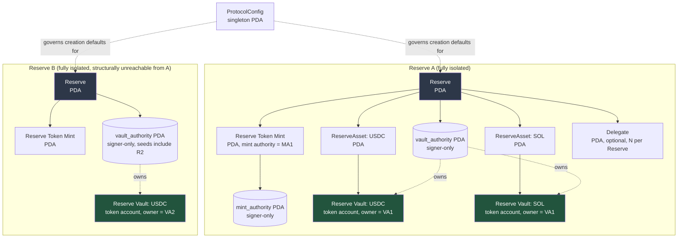
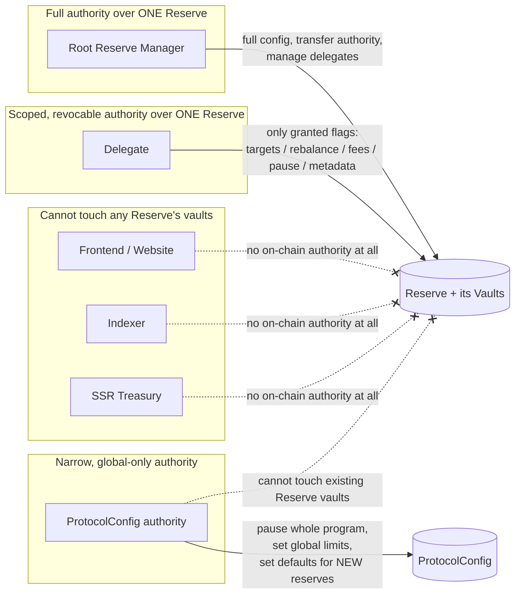

<!--
  Detailed account/PDA model for the SSR Protocol, Gate 2 deliverable.
  Companion to SSR_ARCHITECTURE.md (rationale) and INSTRUCTION_REFERENCE.md
  (per-instruction account lists).
-->

# Account Model

## Diagram: account relationships

The critical property this diagram is meant to convey: **there is no shared vault, no shared authority PDA, and no path in the account graph from Reserve A to any of Reserve B's accounts.** `vault_authority` for Reserve B is a different PDA (different seeds, since seeds include `R2`'s own pubkey) from Reserve A's -- so even a malicious instruction that somehow supplied Reserve B's vault as a "remaining account" to an instruction operating on Reserve A would fail Anchor's `seeds =`/`has_one` constraint check, because the expected PDA for Reserve A's vault_authority can never equal Reserve B's.

## Authority-boundary diagram

## ProtocolConfig (singleton)

**Seeds:** `["protocol_config"]`

| Field | Type | Purpose |
|---|---|---|
| `schema_version` | `u8` | account layout version, for future migration |
| `authority` | `Pubkey` | root SSR program authority (inception wallet initially) |
| `paused` | `bool` | global emergency pause -- blocks creation/mint/rebalance program-wide; **never blocks redemption** on any existing Reserve (see SECURITY_INVARIANTS.md) |
| `max_reserve_assets` | `u8` | current Reserve Asset cap (v1 default: 12, see SSR_ARCHITECTURE.md §4) |
| `default_protocol_fee_bps` | `u16` | default platform-fee-on-mint applied to newly created Reserves (provisional value, see FeeConfig below) |
| `default_protocol_fee_destination` | `Pubkey` | where the platform's cut of fees is sent by default |
| `reserve_count` | `u64` | global counter, also used as the deterministic `reserve_id` seed for the next `create_reserve` call (see "Reserve identifier" below) |
| `bump` | `u8` | PDA bump |

Narrow by design: this account cannot name itself as a vault owner, cannot appear in any `ReserveVault`'s owner chain, and no instruction lets `ProtocolConfig.authority` move tokens out of any Reserve Vault. Compromise of this authority can pause creation of new Reserves and change defaults for future Reserves -- it cannot touch a single token in any already-created Reserve.

## Reserve

**Seeds:** `["reserve", reserve_id.to_le_bytes()]` where `reserve_id` is the `u64` value of `ProtocolConfig.reserve_count` *at creation time* (then incremented). 

*Open question resolved provisionally*: an alternative seed model (`["reserve", creator.key(), nonce]`) would let a creator derive their own Reserve's address client-side before submitting the creation transaction, at the cost of needing a per-creator nonce lookup to avoid collisions across a creator's multiple Reserves. **Decision: use the global `reserve_id` counter from `ProtocolConfig`** (simpler, no per-creator nonce bookkeeping, matches the existing frontend's implicit assumption of one flat Reserve catalog) -- documented as provisional/reversible since it does mean `create_reserve` must read-modify-write `ProtocolConfig.reserve_count`, making Reserve creation not fully parallelizable (two simultaneous `create_reserve` calls will contend on the same `ProtocolConfig` account and one will fail/retry) -- acceptable at DevNet scale, revisit if creation throughput ever matters.

| Field | Type | Purpose |
|---|---|---|
| `schema_version` | `u8` | |
| `reserve_id` | `u64` | matches the seed, kept for convenience/display |
| `manager` | `Pubkey` | root Reserve Manager |
| `reserve_token_mint` | `Pubkey` | this Reserve's Reserve Token mint |
| `status` | enum: `Created \| AssetsInitializing \| Seeded \| Active \| Paused` | tracks resumable multi-step creation (SSR_ARCHITECTURE.md §4) and pause state |
| `asset_count` | `u8` | number of `ReserveAsset`s registered so far (≤ `ProtocolConfig.max_reserve_assets`) |
| `total_target_weight_bps` | `u16` | running sum of registered assets' `target_weight_bps`, ≤ 10000 |
| `created_at` | `i64` | unix timestamp |
| `configured_at` | `i64` | last metadata/target update timestamp |
| `fee_config` | `FeeConfig` (embedded, see below) | |
| `metadata_uri` | `String` (max 200 bytes) | off-chain metadata reference (name/description/logo -- kept off-chain per mission's "metadata reference" field, not embedded fully on-chain) |
| `delegate_count` | `u8` | informational, for discovery/UI |
| `bump` | `u8` | PDA bump |
| `vault_authority_bump` / `mint_authority_bump` | `u8` each | cached bumps for the two signer-only PDAs, avoiding re-derivation cost on every instruction |

`FeeConfig` (embedded struct, all provisional DevNet placeholder values -- see SSR_ARCHITECTURE.md and DECISION_LOG DEC-0013):

| Field | Type | Purpose |
|---|---|---|
| `mint_fee_bps` | `u16` | charged on `mint_reserve_tokens_in_kind`, provisional default 50 (0.50%) |
| `redemption_fee_bps` | `u16` | provisional default 0 (not charged in v1 -- see DEC-0013) |
| `annual_tvl_fee_bps` | `u16` | streamed management fee, provisional default 100 (1.00%/yr) |
| `manager_fee_share_bps` | `u16` | manager's share of the mint+TVL fee pool, out of 10000 |
| `protocol_fee_share_bps` | `u16` | SSR platform's share, out of 10000 -- `manager_fee_share_bps + protocol_fee_share_bps` need not equal 10000 (residual, if any, is documented explicitly, not silently dropped) |
| `fee_destination` | `Pubkey` | manager's fee-recipient address |
| `last_fee_accrual_ts` | `i64` | checkpoint for TVL-fee streaming (see `accrue_fees`) |
| `pending_manager_fee_shares` / `pending_protocol_fee_shares` | `u64` each | accounted-but-not-yet-collected Reserve Token amounts (Folio's deferred-mint pattern, RESERVE_REFERENCE_ANALYSIS.md §8) |

## Reserve Factory

Not a standalone account -- a conceptual grouping of instructions (`create_reserve`, `initialize_reserve_asset`, `seed_reserve`) plus `ProtocolConfig` as the source of global defaults and the `reserve_id` counter. No PDA holds custody on the factory's behalf (SSR_ARCHITECTURE.md §7 / RESERVE_REFERENCE_ANALYSIS.md §2).

## ReserveAsset

**Seeds:** `["reserve_asset", reserve.key(), asset_mint.key()]`

| Field | Type | Purpose |
|---|---|---|
| `reserve` | `Pubkey` | back-reference, also enforced via `has_one` |
| `asset_mint` | `Pubkey` | the SPL Token or Token-2022 mint for this basket asset |
| `vault` | `Pubkey` | this asset's Reserve Vault token account (see below) |
| `token_program` | enum: `SplToken \| Token2022` | which program owns `asset_mint`/`vault` |
| `decimals` | `u8` | cached from the mint, avoids an extra account read in hot paths |
| `target_weight_bps` | `u16` | current target allocation, part of the Reserve's `total_target_weight_bps ≤ 10000` invariant |
| `enabled` | `bool` | disabled assets are excluded from new target-weight math but their existing vault balance remains redeemable |
| `order_index` | `u8` | deterministic ordering (assets are always iterated/displayed in registration order, not PDA/hash order, so client-built instructions and on-chain iteration agree byte-for-byte) |
| `bump` | `u8` | |

Validation enforced at `initialize_reserve_asset` (full detail in `SECURITY_INVARIANTS.md`): rejects a mint already registered for this Reserve (duplicate), rejects a mint whose owning token program isn't one of the two supported programs, rejects Token-2022 mints carrying an extension SSR's balance-delta accounting can't safely handle (transfer-fee, transfer-hook -- see the "Weird ERC20s"-style support matrix in `SECURITY_INVARIANTS.md`), and rejects a `target_weight_bps` that would push `Reserve.total_target_weight_bps` over 10000.

## Reserve Vaults

Each is a plain SPL Token / Token-2022 **token account** (not a custom SSR account type), created via CPI at `initialize_reserve_asset` time:

- **Seeds (for the vault's own address, since it's created as a PDA-owned associated-style account):** `["reserve_vault", reserve.key(), asset_mint.key()]`
- **Owner (authority over the token account, i.e. who can sign transfers out of it):** the `vault_authority` PDA, seeds `["vault_authority", reserve.key()]` -- a signer-only PDA with **no data account of its own**, used purely via `invoke_signed` for CPI transfers out of vaults.

Because both the vault's own address *and* its owner authority are derived from `reserve.key()`, and `reserve.key()` is itself unique per Reserve (§ Reserve above), no two Reserves can ever produce the same vault address or the same owning authority -- this is the concrete mechanism behind the isolation diagram above. An instruction cannot "borrow" Reserve B's vault while operating on Reserve A: even if a malicious client passed Reserve B's vault token account into an instruction meant for Reserve A, the Anchor `seeds = ["reserve_vault", reserve_a.key(), asset_mint.key()], bump` constraint on that account would fail to match the account actually supplied (which was created under `reserve_b.key()`), and the instruction aborts before any transfer CPI executes.

## Reserve Token mint

**Seeds:** `["reserve_token_mint", reserve.key()]` (the mint account itself is a PDA)
**Mint authority:** `["mint_authority", reserve.key()]`, a second signer-only PDA distinct from `vault_authority` (separating "who can move basket assets" from "who can mint/burn the share token" -- a deliberate isolation even though both are ultimately reachable only through the same program's instruction logic, so that a future bug in one code path has a narrower blast radius than if a single PDA held both powers)
**Decimals:** 6
**Freeze authority:** none (`COption::None`)
**Close authority:** N/A (mints aren't closeable)
**Token program:** classic SPL Token (see SSR_ARCHITECTURE.md §2 for the Token-2022 evaluation and rationale)

Supply invariant: `reserve_token_mint.supply` must always be fully explained by proportional backing across all `ReserveVault` balances -- enforced not by an on-chain "total value" check (that would require oracle pricing, contrary to the core mandate) but structurally, because the *only* two instructions capable of changing supply (`mint_reserve_tokens_in_kind`'s internal mint CPI, and `redeem_reserve_tokens_in_kind`'s internal burn CPI) always move basket-asset amounts computed from and atomically alongside the exact same supply change -- see `SECURITY_INVARIANTS.md` for the precise proof-sketch and the adversarial tests that verify it.

## Reserve Manager and delegates

The root Reserve Manager is simply `Reserve.manager` (a plain `Pubkey`, no separate account) -- checked via `has_one = manager` on every manager-gated instruction.

### Delegate

**Seeds:** `["delegate", reserve.key(), delegate_wallet.key()]`

| Field | Type | Purpose |
|---|---|---|
| `reserve` | `Pubkey` | back-reference |
| `wallet` | `Pubkey` | the delegate's address |
| `permissions` | `u16` bitmask | see flag table below |
| `restricted` | `bool` | `true` for an ordinary scoped delegate; `false` only for an "unrestricted" delegate the root manager has explicitly designated (still cannot touch the root-exclusive powers below, but can itself add/remove *restricted* delegates -- see SSR_ARCHITECTURE.md §7) |
| `added_at` | `i64` | |
| `bump` | `u8` | |

Permission bitmask flags (each independently grantable, least-privilege default = all zero):

| Bit | Flag | Grants |
|---|---|---|
| 0 | `UPDATE_METADATA` | change `metadata_uri` |
| 1 | `UPDATE_TARGETS` | change `ReserveAsset.target_weight_bps` values (does **not** move any tokens -- see `update_targets` in INSTRUCTION_REFERENCE.md) |
| 2 | `INITIATE_REBALANCE` | call `record_rebalance`'s "intent" step |
| 3 | `EXECUTE_REBALANCE` | authorize the actual asset-moving step of an approved rebalance |
| 4 | `MANAGE_FEES` | change `FeeConfig` fields other than the protocol's own share |
| 5 | `MANAGE_LIQUIDITY_CONFIG` | configure router/liquidity-related settings (future-facing; not exercised by any v1 instruction, kept reserved so the bitmask doesn't need to grow later) |
| 6 | `PAUSE_RESERVE` | call `pause_reserve` |
| 7 | `UNPAUSE_RESERVE` | call `unpause_reserve` |
| 8 | `ADD_RESTRICTED_DELEGATE` | add a new delegate with `restricted = true` only |
| 9 | `REMOVE_RESTRICTED_DELEGATE` | remove a `restricted = true` delegate |
| 10-15 | reserved | must be zero in v1; any instruction that reads the bitmask masks these off explicitly so a future flag addition can't be accidentally granted by an old, stale-encoded permission value |

The root Reserve Manager implicitly has every permission (checked as `manager == signer OR delegate.permissions & FLAG != 0`, never by giving the manager their own maxed-out `Delegate` record) and, uniquely, the powers no bitmask flag ever grants to anyone: transferring `Reserve.manager` itself, granting/revoking an **unrestricted** delegate, and any future irreversible action.

## Instruction-to-account summary

Full per-instruction account lists, signers, and validation rules are in `docs/protocol/INSTRUCTION_REFERENCE.md`. This document defines the nouns; that one defines the verbs.
